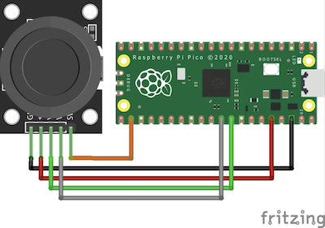
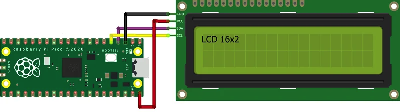
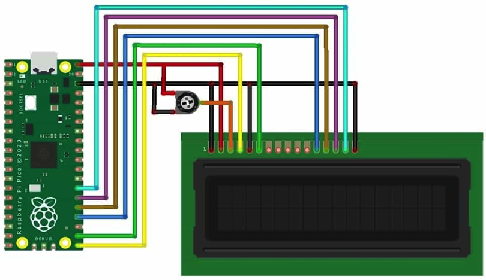

레시피
=====

레시피는 picozero를 사용하는 방법에 대한 예제를 제공합니다.

picozero 임포트하기
-------------------

.. currentmodule:: picozero

picozero를 사용하려면 스크립트 맨 위에 `import` 줄을 추가해야 합니다.

필요한 항목만 임포트할 수 있으며, 항목은 쉼표 ``,``로 구분합니다::

    from picozero import pico_led, LED

이제 스크립트에서 :obj:`~picozero.pico_led`와 :class:`~picozero.LED`를 사용할 수 있습니다::

    pico_led.on() # Raspberry Pi Pico의 내장 LED 켜기
    led = LED(14) # GP14 핀에 연결된 LED 제어 
    led.on()
 
또는 picozero 라이브러리 전체를 임포트할 수도 있습니다::

    import picozero

이 경우 모든 picozero 항목 참조 앞에 접두사를 붙여야 합니다::

    picozero.pico_led.on()
    led = picozero.LED(14)

Pico LED
--------

.. image:: ../images/pico_led.svg
    :alt: 내장 LED에 GP25 라벨이 붙은 Raspberry Pi Pico 다이어그램.

Raspberry Pi Pico의 LED를 켜려면:

.. literalinclude:: ../examples/pico_led.py

스크립트를 실행하여 LED가 켜지는지 확인하십시오.

:obj:`pico_led`를 사용하는 것은 다음과 동일합니다::

    pico_led = LED(25) 

:obj:`pico_led`는 :class:`LED`를 사용하여 만든 외부 LED와 동일한 방식으로 사용할 수 있습니다.

핀 배열 (Pin out)
-----------------

핀과 핀 번호를 표시하는 Raspberry Pi Pico의 *다이어그램*을 출력할 수 있습니다.

.. literalinclude:: ../examples/print_pinout.py

::

            ---usb---
    GP0  1  |o     o| -1  VBUS
    GP1  2  |o     o| -2  VSYS
    GND  3  |o     o| -3  GND
    GP2  4  |o     o| -4  3V3_EN
    GP3  5  |o     o| -5  3V3(OUT)
    GP4  6  |o     o| -6           ADC_VREF
    GP5  7  |o     o| -7  GP28     ADC2
    GND  8  |o     o| -8  GND      AGND
    GP6  9  |o     o| -9  GP27     ADC1
    GP7  10 |o     o| -10 GP26     ADC0
    GP8  11 |o     o| -11 RUN
    GP9  12 |o     o| -12 GP22
    GND  13 |o     o| -13 GND
    GP10 14 |o     o| -14 GP21
    GP11 15 |o     o| -15 GP20
    GP12 16 |o     o| -16 GP19
    GP13 17 |o     o| -17 GP18
    GND  18 |o     o| -18 GND
    GP14 19 |o     o| -19 GP17
    GP15 20 |o     o| -20 GP16
            ---------

LED
---
 
.. image:: ../images/pico_led_14_bb.svg
    :alt: GP14와 GND에 노란색 LED가 연결된 Raspberry Pi Pico 다이어그램.

Raspberry Pi Pico로 외부 LED를 제어할 수 있습니다.

깜빡이기 (Flash)
~~~~~~~~~~~~~~

:class:`LED`를 켜고 끕니다:

.. literalinclude:: ../examples/led_on_off.py

:class:`LED`를 토글하여 켜짐 상태에서 꺼짐 상태로 또는 그 반대로 바꿉니다:

.. literalinclude:: ../examples/led_toggle.py

또는 :meth:`~picozero.LED.blink` 메서드를 사용할 수 있습니다.

.. literalinclude:: ../examples/led_blink.py

밝기 (Brightness)
~~~~~~~~~~~~~~~~

:class:`LED`의 밝기를 설정합니다:

.. literalinclude:: ../examples/led_brightness.py

맥박 효과(pulse effect) 만들기:

.. literalinclude:: ../examples/led_pulse.py

또는 :meth:`~picozero.LED.pulse` 메서드를 사용할 수 있습니다.

.. literalinclude:: ../examples/led_pulse_method.py

버튼 (Buttons)
--------------

버튼과 스위치를 Raspberry Pi Pico에 연결하고 눌렸을 때를 감지할 수 있습니다. 

:class:`Button`이 눌렸는지 확인하기:

.. literalinclude:: ../examples/button_is_pressed.py

:class:`Button`이 눌릴 때마다 함수 실행하기:

.. literalinclude:: ../examples/button_function.py

.. note::

    ``button.when_pressed = led_on_off`` 줄은 ``led_on_off`` 함수를 즉시 실행하는 것이 아니라, 버튼이 눌렸을 때 호출될 함수에 대한 참조를 생성합니다. 실수로 ``button.when_pressed = led_on_off()``를 사용하면 ``when_pressed`` 동작이 :data:`None`(이 함수의 반환 값)으로 설정되어 버튼을 눌러도 아무 일도 일어나지 않습니다.

:class:`Button`을 눌렀을 때 :obj:`pico_led`를 켜고 뗐을 때 끄기:

.. literalinclude:: ../examples/button_led.py

RGB LED
-------

:class:`RGBLED`로 색상 설정하기:

.. literalinclude:: ../examples/rgb_led.py

:meth:`~picozero.RGBLED.toggle` 및 :meth:`~picozero.RGBLED.invert` 사용하기:

.. literalinclude:: ../examples/rgb_toggle_invert.py

깜빡이기 (Blink)
~~~~~~~~~~~~~~~

색상 사이를 변경하려면 :meth:`~picozero.RGBLED.blink`를 사용하십시오. 어떤 색상을 사용할지, 각 색상이 얼마나 유지될지 제어할 수 있습니다. 색상 `(0, 0, 0)`은 꺼짐을 의미합니다. 

:meth:`~picozero.RGBLED.blink`가 정해진 횟수만큼 실행될지, 끝날 때까지 기다릴지, 아니면 다른 코드가 실행될 수 있도록 즉시 반환할지 제어할 수 있습니다.

.. literalinclude:: ../examples/rgb_blink.py

맥박 (Pulse)
~~~~~~~~~~~

LED 색상을 점진적으로 변경하려면 :meth:`~picozero.RGBLED.pulse`를 사용하십시오. 기본값은 빨간색과 꺼짐, 초록색과 꺼짐, 파란색과 꺼짐 사이를 맥박처럼 움직입니다. 

.. literalinclude:: ../examples/rgb_pulse.py

순환 (Cycle)
~~~~~~~~~~~

:meth:`~picozero.RGBLED.cycle`의 기본값은 빨간색에서 초록색으로, 초록색에서 파란색으로, 파란색에서 빨간색으로 순환하는 것입니다. 

.. literalinclude:: ../examples/rgb_cycle.py

가변 저항 (Potentiometer)
-------------------------

가변 저항이 보고하는 값, 전압 및 퍼센트를 출력합니다:

.. literalinclude:: ../examples/potentiometer.py

.. note::

    Thonny Python 에디터에서 **보기(View)** > **플로터(Plotter)**를 선택하면 :meth:`print`의 출력을 그래프로 볼 수 있습니다. 

가변 저항을 사용하여 LED의 밝기를 제어합니다:

.. literalinclude:: ../examples/pot_led.py

조이스틱 (Joystick)
------------------

조이스틱은 가변 저항과 유사하므로 Pot 클래스를 사용하여 조이스틱을 제어할 수 있습니다.

조이스틱을 최소, 중간 및 최대 위치로 움직여 보십시오.

.. literalinclude:: ../examples/joystick.py

부저 (Buzzer)
-------------

전원이 공급될 때 음을 재생하는 능동 부저를 제어합니다:

.. literalinclude:: ../examples/buzzer.py

스피커 (Speaker)
---------------

다양한 톤이나 주파수를 재생할 수 있는 수동 부저나 스피커를 제어합니다:

.. literalinclude:: ../examples/speaker.py

멜로디 연주하기
~~~~~~~~~~~~~

음 이름과 박자 길이를 사용하여 멜로디를 연주합니다: 

.. literalinclude:: ../examples/speaker_tune.py

개별 음 연주하기
~~~~~~~~~~~~~~

개별 음을 연주하고 타이밍을 제어하거나 다른 동작을 수행합니다:

.. literalinclude:: ../examples/speaker_notes.py

서보 모터 (Servo)
---------------

단일 핀, 3.3v 및 그라운드에 연결된 서보 모터입니다.

.. image:: ../images/servo.svg
    :alt: 서보 모터에 연결된 Raspberry Pi Pico 다이어그램

서보를 최소, 중간 및 최대 위치로 움직입니다.

.. literalinclude:: ../examples/servo_move.py

서보를 최소 위치와 최대 위치 사이에서 맥박처럼 움직입니다.

.. literalinclude:: ../examples/servo_pulse.py

서보를 최소 위치에서 최대 위치까지 100단계로 점진적으로 움직입니다.

.. literalinclude:: ../examples/servo_sweep.py

모터 (Motor)
-----------

두 개의 핀(전진 및 후진)과 모터 드라이버 보드를 통해 연결된 모터를 움직입니다:

.. literalinclude:: ../examples/motor_move.py

로봇 로버 (Robot rover)
---------------------

간단한 이륜 로봇 로버를 만듭니다.

.. image:: ../images/robot_bb.svg
    :alt: 배터리 팩으로 전원이 공급되는 모터 드라이버 보드를 통해 두 개의 모터에 연결된 Raspberry Pi Pico 다이어그램.

로버를 1초 동안 앞으로 움직이고 멈춥니다:

.. literalinclude:: ../examples/robot_rover_forward.py

로버를 (대략) 사각형 모양으로 움직입니다:

.. literalinclude:: ../examples/robot_rover_square.py

내부 온도 센서
-------------

Raspberry Pi Pico의 내부 온도를 섭씨 단위로 확인합니다:

.. literalinclude:: ../examples/pico_temperature.py

초음파 거리 센서
---------------

초음파 거리 센(HC-SR04)로부터의 거리를 센티미터 단위로 가져옵니다:

.. image:: ../images/distance_sensor_bb.svg
    :alt: HC-SR04 거리 센서에 연결된 Raspberry Pi Pico 다이어그램.

.. literalinclude:: ../examples/ultrasonic_distance_sensor.py

LCD 디스플레이
--------------

I2C 버스와 PCF8574 I2C 어댑터를 사용하여 LiquidCrystal 디스플레이(LCD)에 문자를 출력합니다.

.. literalinclude:: ../examples/i2c_lcd.py

GPIO 핀만 사용하여 LiquidCrystal 디스플레이(LCD)에 문자를 출력합니다.

.. literalinclude:: ../examples/lcd.py
